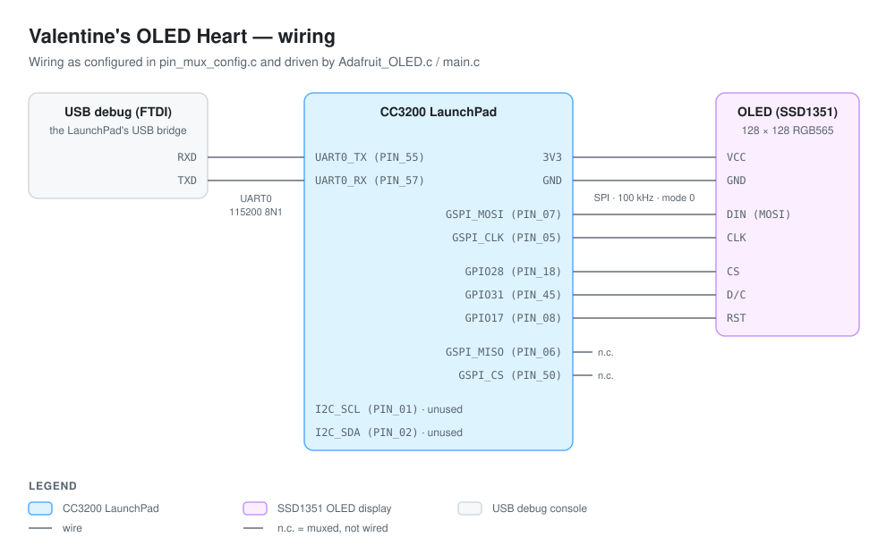
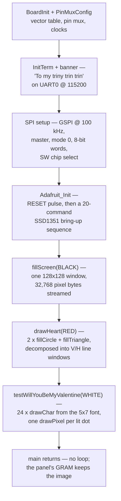

# Valentine's OLED Heart (formyTrinyTrinTrin)

A bare-metal **CC3200 (ARM Cortex-M4)** program that asks a question on a **128×128 SSD1351 color OLED**: it draws a geometric heart — two `fillCircle` lobes and a `fillTriangle` point — in RGB565 red, centers **"Will you be my / Valentine?"** beneath it in a 5×7 bitmap font, and greets a 115200-baud UART console with *"To my triny trin trin"*. Yes, the repo name and the banner say it plainly: this is a **gift build** — but under the sentiment sits the full Adafruit GFX + SSD1351 graphics stack, ported to plain C and driven over a hand-rolled 4-wire SPI byte path.

The interesting part isn't the sixty lines that draw the heart — it's the **byte path underneath them**: every pixel on the panel is the product of `writeCommand`/`writeData` choreographing **three GPIO control lines** (D/C on PIN_45, CS on PIN_18, RESET on PIN_08) around a blocking one-byte SPI transaction at **100 kHz**, with the SSD1351's window-address model (`SETCOLUMN` → `SETROW` → `WRITERAM`, then a raw pixel stream) doing the real drawing work in hardware.

---

## Table of Contents

1. [What It Draws](#what-it-draws)
2. [Wiring](#wiring)
3. [From main() to the Panel](#from-main-to-the-panel)
4. [Repository Map](#repository-map)
5. [The Display Driver — Adafruit_OLED.c](#the-display-driver--adafruit_oledc)
6. [The GFX Core — Geometry & Text](#the-gfx-core--geometry--text)
7. [The Debug UART](#the-debug-uart)
8. [Compiled but Unused](#compiled-but-unused)
9. [Build & Flash](#build--flash)
10. [Known Limitations & Sharp Edges](#known-limitations--sharp-edges)
11. [Provenance](#provenance)

---

## What It Draws

One static frame, composed in [main.c](main.c) with exact coordinates:

```text
(0,0)                                        (127,0)
  ┌──────────────────────────────────────────┐
  │         ●(52,40)      ●(76,40)           │   two fillCircle lobes, r = 12
  │     (40,40)──────────────────(88,40)     │   fillTriangle top edge
  │           \                 /            │
  │             \             /              │   all of it RED (0xF800)
  │               \         /                │
  │                (64,64)                   │   triangle bottom point
  │                                          │
  │          Will you be my    ← y=90, x=22  │   14 chars × 6 px, centered
  │            Valentine?      ← y=98, x=34  │   10 chars × 6 px, centered
  └──────────────────────────────────────────┘
(0,127)                                    (127,127)
```

`drawHeart` centers on `SSD1351WIDTH / 2 = 64`, places the lobe circles at `centerX ± radius` with `radius = 12`, and spans the triangle `2 × radius` to each side. `testWillYouBeMyValentine` computes each line's x-offset as `(128 − len × 6) / 2` and draws character by character in white on black. The frame is drawn once; the SSD1351's own graphics RAM holds it from then on.

## Wiring



Every pin below is verified against [pin_mux_config.c](pin_mux_config.c) (generated by TI PinMux 4.0.1543) and the GPIO writes in [Adafruit_OLED.c](Adafruit_OLED.c):

| CC3200 pin | Mux | Role |
|---|---|---|
| PIN_05 | GSPI_CLK (mode 7) | OLED CLK |
| PIN_07 | GSPI_MOSI (mode 7) | OLED DIN |
| PIN_18 | GPIO28, output | OLED CS (driven low/high around every byte) |
| PIN_45 | GPIO31, output | OLED D/C (0 = command, 1 = data) |
| PIN_08 | GPIO17, output | OLED RESET (pulsed low at init) |
| PIN_55 / PIN_57 | UART0 TX / RX (mode 3) | debug console via the LaunchPad's USB bridge |
| PIN_06 | GSPI_MISO (mode 7) | muxed, unconnected — the OLED never talks back |
| PIN_50 | GSPI_CS (mode 9) | muxed, and pulsed by the driver — but configured **active-high**, so the OLED's active-low CS must be the GPIO on PIN_18 |
| PIN_01 / PIN_02 | I2C SCL / SDA (mode 1) | muxed and clocked, never used by any code |

## From main() to the Panel



Every arrow bottoms out in the same two functions: `writeCommand(c)` and `writeData(c)` — one byte, one SPI transaction, D/C telling the SSD1351 which of the two it is.

## Repository Map

```text
formyTrinyTrinTrin-main/
├── README.md               # you are here
├── SYSTEM-DESIGN.md        # the architecture-level view
├── docs/
│   └── wiring-diagram.svg  # the schematic above
├── main.c                  # boot sequence, drawHeart, testWillYouBeMyValentine
├── pin_mux_config.c / .h   # TI PinMux-generated pin config (SPI, UART0, I2C, 3 GPIOs)
├── Adafruit_OLED.c         # SSD1351 driver: writeCommand/writeData, init sequence,
│                           #   goTo, fillRect/fillScreen, fast H/V lines, drawPixel
├── Adafruit_SSD1351.h      # 31 SSD1351 command opcodes, 128x128 geometry, driver API
├── Adafruit_GFX.c / .h     # Adafruit's GFX core ported to C: circles, triangles,
│                           #   lines, rects, drawChar — everything funnels to the driver
├── glcdfont.h              # 5x7 ASCII font — 255 glyphs x 5 bytes = 1,275 bytes
├── oled_test.c / .h        # Adafruit's test-pattern suite + color defines (compiled, never called)
├── uart_if.c               # TI SDK UART terminal (InitTerm/Message/Report...)
├── i2c_if.c                # TI SDK polled I2C driver (compiled, never called)
├── cc3200v1p32.cmd         # linker script — everything in SRAM from 0x20004000
├── targetConfigs/          # CCS debug-probe config (Stellaris ICDI)
├── .ccsproject / .cproject # Code Composer Studio 12.5 project (TI ARM compiler 20.2.7.LTS)
├── .launches/, .settings/  # CCS/Eclipse metadata
├── README.html             # TI's original spi_demo example doc — SDK leftover
├── FILELIST.txt            # generated file inventory — build artifact
└── Debug/                  # CCS build output (spi_demo.bin/.out/.map) — build artifacts
```

## The Display Driver — Adafruit_OLED.c

The SSD1351 has no framebuffer on the MCU side — the panel's controller owns the pixels. The driver speaks its window-address protocol:

- **`writeCommand(c)` / `writeData(c)`** — the only two ways bytes reach the panel. Each call: set D/C (low for command, high for data), drop the GPIO CS, `SPICSEnable`, a blocking `SPIDataPut` + dummy `SPIDataGet` (full-duplex flush), `SPICSDisable`, raise the GPIO CS. Five register writes and a blocking read *per byte*.
- **`Adafruit_Init()`** — pulses RESET low→high (with a ~100-iteration settle loop), then walks a 20-command bring-up list: unlock (`0xFD` with `0x12`, then `0xB1`), display off, clock divider `0xF1`, MUX ratio 127, remap `0x74`, full 0–127 column/row window, contrast `C8/80/C8`, VSL, precharge, and finally `DISPLAYON`.
- **`fillRect`** — the one genuinely accelerated primitive: set a `w×h` window with `SETCOLUMN`/`SETROW`, issue `WRITERAM`, then stream `w×h` RGB565 pixels (high byte, low byte) while the controller advances the address itself. `fillScreen` is a 128×128 `fillRect` — 32,768 data bytes.
- **`drawFastVLine` / `drawFastHLine`** — 1-pixel-wide windows, same streaming trick. These are what the GFX core's circles and triangles actually decompose into.
- **`drawPixel`** — `goTo(x, y)` opens a window from (x, y) clear to the panel's bottom-right corner (127, 127), and two data bytes paint just its first pixel. Text is drawn this way, dot by dot.

## The GFX Core — Geometry & Text

[Adafruit_GFX.c](Adafruit_GFX.c) is Adafruit's Arduino C++ library flattened into C — the class wrapper is commented out, member state (`cursor_x`, `textcolor`, `textsize`…) became file-scope globals, and the "virtual" link between the core and the driver is simply the linker resolving `drawPixel`/`drawFastVLine`/`fillRect` to the SSD1351 versions:

- **`fillCircle`** — midpoint circle algorithm producing vertical line spans (`fillCircleHelper` + a center `drawFastVLine`).
- **`fillTriangle`** — sorts vertices by y, then walks scanlines emitting `drawFastHLine` spans for the upper and lower halves.
- **`drawChar`** — reads 5 column bytes per glyph from [glcdfont.h](glcdfont.h), draws lit bits in the foreground color and (because `bg != color`) unlit bits in the background color, in a 6×8 cell at `size = 1`.
- **`drawLine`** (Bresenham), rects, round-rects, and `Outstr` are all present too — this project only exercises the circle, triangle, and char paths.

## The Debug UART

[uart_if.c](uart_if.c) is TI's stock terminal layer on **UART0 at 115200 8N1** (`CONSOLE = UARTA0_BASE`, from the SDK's `uart_if.h`). `main` uses exactly three calls — `InitTerm`, `ClearTerm` (an ANSI `ESC[2J`), and `Message` for the four-line banner. The fancier machinery (`Report`'s printf with a growing malloc'd buffer, `GetCmd`'s line editor with echo and backspace) is linked in but never called.

## Compiled but Unused

Honest inventory — all of this is compiled and none of it runs:

- **[i2c_if.c](i2c_if.c)** — TI's polled I2C driver (`I2C_IF_Open/Read/Write/ReadFrom`). The pin mux even assigns PIN_01/PIN_02 to I2C and clocks `PRCM_I2CA0`; the LaunchPad's onboard BMA222 accelerometer sits on that bus, unread. Scaffolding for a lab this project didn't need.
- **[oled_test.c](oled_test.c)** — the full Adafruit test-pattern suite (lines, rects, circles, triangles, round-rects, two LCD test patterns, a font-table dump, hello-world). `main.c` includes the header and calls none of it — and per the checked-in link map ([Debug/spi_demo.map](Debug/spi_demo.map)), `oled_test.obj` isn't even in the checked-in linked image.
- **`GSPI_CS` (PIN_50) and `GSPI_MISO` (PIN_06)** — muxed but effectively dead: the OLED's chip select is the GPIO on PIN_18, and nothing ever reads MISO.
- **Ceremony in `main`** — `setCursor(10, 90)` and `setTextColor(WHITE, BLACK)` set GFX globals that `testWillYouBeMyValentine` then ignores (it passes explicit coordinates and colors to `drawChar`). `APPLICATION_VERSION "1.4.0"` and `TR_BUFF_SIZE 100` are defined and never used.

## Build & Flash

Honestly: you need real hardware and TI's toolchain. This is a **Code Composer Studio 12.5** managed project (`spi_demo`) for the **CC3200 LaunchPad (CC3200-LAUNCHXL)**, compiled with TI ARM compiler **20.2.7.LTS** against **CC3200 SDK 1.5.0**.

1. Install CCS and the CC3200 SDK. The project expects the SDK at `/Applications/TI/lib/cc3200sdk_1.5.0/cc3200-sdk` (macOS paths are baked into `.project` and the `Debug/` makefiles — retarget the `CC3200_SDK_ROOT` path variable if yours lives elsewhere).
2. `File → Import → CCS Projects` and select this directory. Note that `startup_ccs.c` is a **linked resource** pulled from `CC3200_SDK_ROOT/example/common/` — it is not in this repo, so the import fails visibly if the SDK path is wrong.
3. Connect the LaunchPad (with SOP jumpers set for debug), Build, then Debug — the launch config ([.launches/spi_demo.launch](.launches/spi_demo.launch)) loads `spi_demo.out` over the Stellaris ICDI probe into SRAM and runs it.
4. Optionally open a serial terminal on the LaunchPad's COM port at **115200 8N1** to see the banner.

The linker script ([cc3200v1p32.cmd](cc3200v1p32.cmd)) places everything in SRAM — 76 KB of code at `0x20004000`, 100 KB of data at `0x20017000`. A debug load therefore **does not survive a power cycle**; to make the heart permanent, flash `Debug/spi_demo.bin` to the board's serial flash as `/sys/mcuimg.bin` with TI UniFlash.

## Known Limitations & Sharp Edges

Honest notes, all verified in the code:

- **`main` falls off the end.** There is no `while(1)` after the final `drawChar` — execution returns into the C runtime. The image survives only because the SSD1351's GRAM retains it; the MCU itself is done.
- **Two chip selects, one of them backwards.** The SPI module is configured `SPI_SW_CTRL_CS | SPI_CS_ACTIVEHIGH` and the driver calls `SPICSEnable/Disable` around every byte — driving the hardware CS (PIN_50) *high* during transfers, the wrong polarity for the OLED. The transfer works because the GPIO CS on PIN_18 is toggled active-low in the same functions. Belt, suspenders, and one of them inside-out.
- **The RESET comment lies.** `Adafruit_Init`'s scaffolding comment says RESET is "wired to GPIO28, pin 18" — but the code pulses `GPIOA2` bit `0x2` (GPIO17 = **PIN_08**) for RESET and uses PIN_18/GPIO28 as **CS**. Trust `pin_mux_config.c` and the GPIO writes, not the comment.
- **Three init parameters are sent as commands.** The clock-divider value `0xF1`, precharge `0x32`, and VCOMH `0x05` go out via `writeCommand` (D/C low) instead of `writeData` — a quirk inherited from Adafruit's original init sequence, running with the command lock opened by `0xB1`. The display comes up regardless.
- **It's slow by construction.** 100 kHz SPI means a full-screen fill streams 262,144 bits — over **2.6 seconds** of pure shift time — and each of those 32,768 bytes pays the full writeData overhead (3 GPIO writes, CS enable/disable, a blocking dummy read). Fine for one static frame; hopeless for animation without raising `SPI_IF_BIT_RATE` and batching transfers.
- **Clipping is off by one.** `fillRect`, `drawFastVLine`, and `drawFastHLine` clamp overflow as `HEIGHT − y − 1`, losing one row/column on any shape that touches the edge (a full-screen fill is unaffected — `128 > 128` is false, so no clamp fires).
- **Negative coordinates are not everyone's problem.** `drawPixel` rejects `x < 0`, but the fast-line functions don't, and `fillRect` takes *unsigned* coordinates, so a negative input wraps enormous. This program stays on-screen, so it never bites here.
- **The build is chained to one machine's paths.** Absolute references to `/Applications/TI/...` and a stale include path to `/Users/kuyabasti/EEC172/wst/spi_demo` live in the checked-in `Debug/` makefiles; CCS regenerates them, but a command-line build of this tree as-is would not work anywhere else.
- **`Adafruit_SSD1351.h`'s banner says SSD1331** — an upstream Adafruit copy-paste artifact; every opcode in the file is SSD1351.

## Provenance

Three layers, clearly separable by file headers:

- **TI scaffolding** — the project began life as the CC3200 SDK 1.5.0 `spi_demo` example (the `.ccsproject` records its origin projectspec; [README.html](README.html) is TI's original doc for it, kept untouched). [uart_if.c](uart_if.c) and [i2c_if.c](i2c_if.c) carry TI's 2014 copyright headers; [pin_mux_config.c](pin_mux_config.c) was generated by TI PinMux 4.0.1543 on 1/25/2025; [cc3200v1p32.cmd](cc3200v1p32.cmd) and the linked `startup_ccs.c` are stock SDK.
- **Adafruit, ported to C** — [Adafruit_GFX.c](Adafruit_GFX.c) (© 2013 Adafruit Industries, BSD), [Adafruit_SSD1351.h](Adafruit_SSD1351.h) (Limor Fried/Ladyada), the [glcdfont.h](glcdfont.h) 5×7 font, and [oled_test.c](oled_test.c) (adapted from Adafruit's Arduino `test.ino`, linked in its header). The C++ classes are commented out in place — the port keeps the original code visible.
- **Lab-course scaffolding, then this project** — the `TODO 1/2/3` markers in [Adafruit_OLED.c](Adafruit_OLED.c) and the `oled_test.h` header (*"Created on: Jan 27, 2024, Author: rtsang"*) mark this as an embedded-systems lab skeleton — the checked-in build files still record its original home in an `EEC172` course directory. The work implemented on top of it is the SPI byte path (`writeCommand`, `writeData`, the `Adafruit_Init` GPIO sequencing), the pin choices, and the whole of `main.c` — `drawHeart`, `testWillYouBeMyValentine`, and the boot flow that puts a heart on a screen for one particular person.

See [SYSTEM-DESIGN.md](SYSTEM-DESIGN.md) for the architecture-level view: the full data-flow diagram, the byte-path anatomy, and the numbers that matter.
