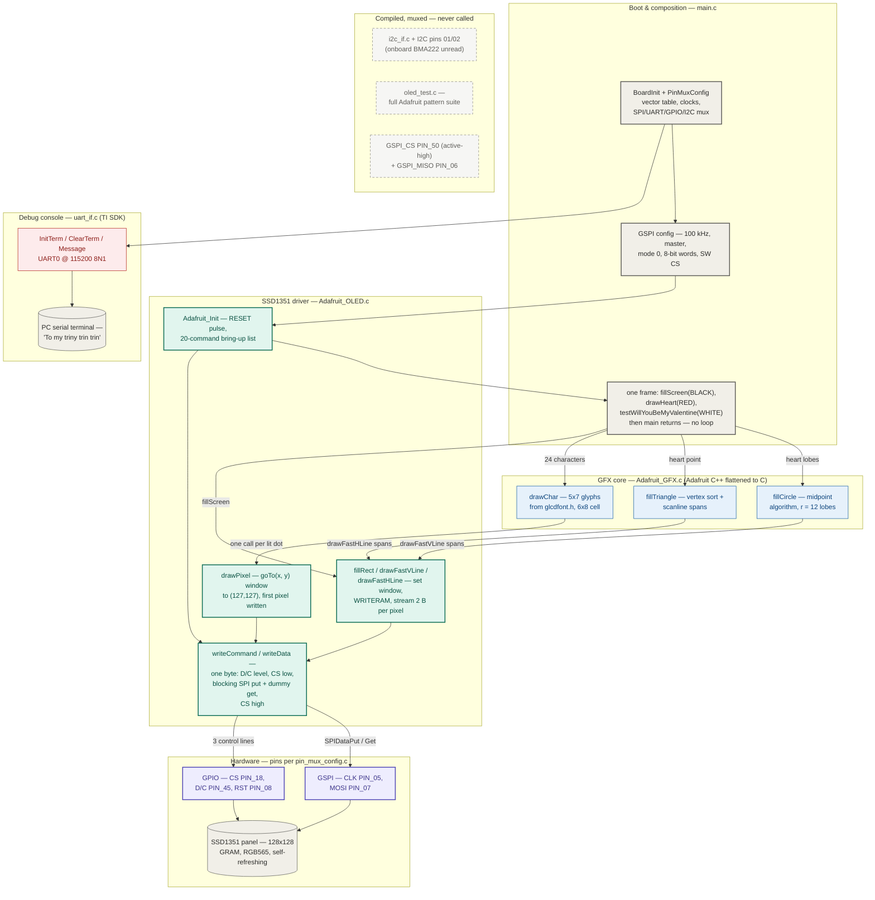
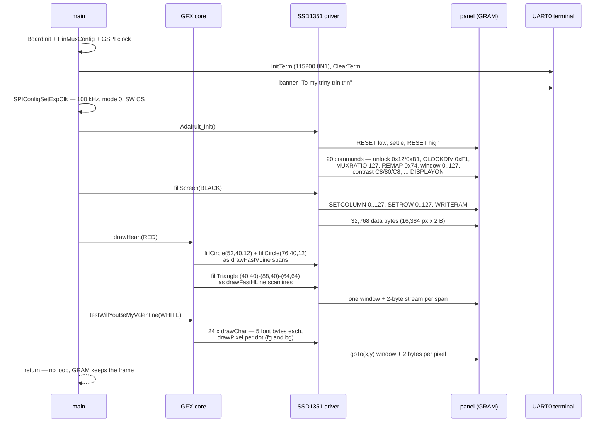

# Valentine's OLED Heart — system design

> How a question becomes 16,384 pixels, two bytes at a time.
>
> A CC3200 boots, muxes its pins, and opens a **100 kHz SPI channel** to an
> SSD1351 OLED whose controller owns all the pixels — there is no framebuffer
> on the MCU at all. Drawing is window arithmetic: set a column range, set a
> row range, say `WRITERAM`, and stream RGB565 bytes while the panel advances
> its own address counter. On top of that sit Adafruit's GFX primitives,
> flattened from C++ to C, decomposing a heart into **circle spans and
> triangle scanlines** and a proposal into **5×7 font dots**. One frame is
> drawn, `main` returns, and the panel's own GRAM keeps the heart lit.

This document is the developer-facing map of the whole system — every
component and how data moves between them. The companion [README](README.md)
covers the wiring, per-layer detail, building, and flashing.

---

## End-to-end flowchart



**Legend** — ⬜ boot / panels & terminal · 🟦 GFX core · 🟩 SSD1351 driver ·
🟪 SPI + GPIO hardware · 🟥 debug UART ·
◌ dashed = compiled and pin-muxed but never exercised (I2C, test suite,
hardware CS/MISO). The physical pin map is in the
[wiring diagram](docs/wiring-diagram.svg).

---

## How to read it: the three ideas that matter

1. **The framebuffer lives on the far side of the wire.** The CC3200 never
   holds a pixel; the SSD1351's controller owns the 128×128 GRAM and repaints
   the panel from it forever. Drawing is therefore *address arithmetic plus a
   byte stream*: `SETCOLUMN`, `SETROW`, `WRITERAM`, then raw RGB565 pairs
   while the controller walks its own address counter. That's also why `main`
   can simply return — the image doesn't need the MCU once it's in GRAM. The
   entire rendering stack exists to convert shapes into the fewest, widest
   windows: `fillRect` streams whole rectangles, the circle and triangle
   fillers emit one-pixel-wide line windows, and only text falls all the way
   down to `drawPixel`, whose `goTo(x, y)` window runs clear to the panel's
   corner (127, 127) and receives a single pixel.

2. **The layering is Arduino C++ flattened to C, port-by-commenting.** In
   Adafruit's original library, `Adafruit_GFX` is a base class and the
   SSD1351 driver overrides its virtuals. Here the class syntax is literally
   commented out in place — member state became file-scope globals
   (`cursor_x`, `textcolor`, `textsize`), and the virtual dispatch became the
   linker resolving `drawPixel`, `drawFastVLine`, `drawFastHLine`, and
   `fillRect` to the driver's implementations. The seam between "geometry"
   and "hardware" survives the port intact: `Adafruit_GFX.c` contains zero
   SPI calls, and `Adafruit_OLED.c` contains zero geometry.

3. **Two wires move the bytes; three GPIOs give them meaning.** SPI carries
   an undifferentiated byte stream (CLK on PIN_05, MOSI on PIN_07 — MISO is
   muxed but the OLED never talks back). Whether a byte is an opcode or a
   parameter/pixel is decided entirely by the D/C line (PIN_45) that
   `writeCommand`/`writeData` set before each transfer; CS (PIN_18) frames
   every single byte, and RESET (PIN_08) exists only for the init pulse.
   Every byte also pays for a blocking dummy read — `SPIDataGet` after
   `SPIDataPut` — which doubles as the "transfer complete" synchronization.
   The protocol is in the choreography, not the channel.

---

## Deep dive 1 — boot to heart, end to end

One cold boot, every command verified against the source:



Things worth noticing:

- **The window is the unit of progress.** A circle lobe of radius 12 becomes
  37 `drawFastVLine` calls (four per midpoint iteration plus the center
  line — several columns are windowed twice), each one
  `SETCOLUMN`/`SETROW`/`WRITERAM` plus a short pixel stream — dozens of
  windows instead of 16,384 individual pixel addresses. Text goes the slow
  way: `drawChar` calls `drawPixel` for *both* lit and unlit bits
  (foreground and background), so each 6×8 character cell is up to 48
  separate window set-ups.
- **The banner precedes the picture.** UART0 is initialized and the greeting
  printed before the SPI module is even reset — so a dead display with a live
  banner cleanly separates "board boots" from "OLED wiring problem", which is
  exactly how the [wiring section](README.md#wiring) is meant to be debugged.
- **The order of the last three steps is the flicker strategy.** Black fill,
  then heart, then text — strictly bottom-up compositing with no clearing in
  between, so nothing drawn is ever overdrawn. Deterministic, single-pass,
  done.

## Deep dive 2 — anatomy of one byte on the wire

Every visible pixel funnels through `writeData` (and every opcode through its
twin `writeCommand`, identical except D/C goes low). The choreography per
byte:

```text
 writeData(c)                        signals during the transfer
 ────────────────────────────        ─────────────────────────────────
 1. GPIOA3 bit 0x80 → 1              D/C  (PIN_45)  ▔▔▔▔▔▔▔▔▔▔  high = data
 2. GPIOA3 bit 0x10 → 0              CS   (PIN_18)  ▔▔╲________  active low
 3. MAP_SPICSEnable(GSPI)            (hw CS PIN_50 — active-HIGH, not the
                                      line the OLED listens to)
 4. MAP_SPIDataPut(GSPI, c)          MOSI (PIN_07)  ─┤ 8 bits ├─
                                     CLK  (PIN_05)  ─┤ 100 kHz ├─
 5. MAP_SPIDataGet(GSPI, &dummy)     blocks until the shift completes —
                                     the de-facto "transfer done" wait
 6. MAP_SPICSDisable(GSPI)
 7. GPIOA3 bit 0x10 → 1              CS   (PIN_18)  ________╱▔▔
```

- **Cost accounting:** at 100 kHz the 8 data bits alone take 80 µs, and steps
  1–3 and 6–7 add five register writes per byte on top. A full-screen fill is
  32,768 of these round trips — ≈ 2.62 s of pure shift time, before overhead.
  The design accepts this because the program draws exactly one frame.
- **The dummy read is load-bearing.** GSPI is full-duplex; every `SPIDataPut`
  latches a receive byte that must be drained. Reading it into `ulDummy` both
  clears the FIFO and blocks until the byte has actually left the pin —
  remove it and CS would rise mid-shift.
- **The double chip select** (GPIO PIN_18 *and* the active-high hardware CS
  on PIN_50) is harmless redundancy today, but it means the SPI module's
  idea of "selected" and the OLED's are opposite — anyone rewiring CS to
  PIN_50 without flipping `SPI_CS_ACTIVEHIGH` gets a dark screen.

---

## Component inventory

| Component | Layer | Provenance | Where |
|---|---|---|---|
| Boot flow, `drawHeart`, `testWillYouBeMyValentine` | App | ✅ implemented here | [main.c](main.c) |
| `writeCommand` / `writeData` / `Adafruit_Init` GPIO+SPI bodies | Driver | ✅ implemented here (lab `TODO 1/2/3` slots) | [Adafruit_OLED.c](Adafruit_OLED.c) |
| Window primitives — `fillRect`, fast lines, `drawPixel`, `goTo` | Driver | Adafruit, ported to C | [Adafruit_OLED.c](Adafruit_OLED.c) |
| GFX geometry & text — circles, triangles, `drawChar` | GFX | Adafruit (© 2013, BSD), ported to C | [Adafruit_GFX.c](Adafruit_GFX.c) |
| SSD1351 opcodes (31 defines), 128×128 geometry | Types | Adafruit (Limor Fried/Ladyada) | [Adafruit_SSD1351.h](Adafruit_SSD1351.h) |
| 5×7 ASCII font — 255 glyphs, 1,275 bytes | Data | Adafruit `glcdfont` | [glcdfont.h](glcdfont.h) |
| Pin mux — SPI, UART0, I2C, 3 GPIOs | Board | generated (TI PinMux 4.0.1543) | [pin_mux_config.c](pin_mux_config.c) |
| UART terminal — `InitTerm`, `Message`, `Report`, `GetCmd` | Console | TI SDK scaffolding | [uart_if.c](uart_if.c) |
| Polled I2C driver | — | ⬜ TI SDK, compiled, never called | [i2c_if.c](i2c_if.c) |
| Test-pattern suite (lines/rects/circles/patterns/font dump) | — | ⬜ Adafruit `test.ino` port, never called | [oled_test.c](oled_test.c) |
| Linker script — all-SRAM image at `0x20004000` | Build | TI SDK scaffolding | [cc3200v1p32.cmd](cc3200v1p32.cmd) |
| CCS 12.5 project, ICDI debug config, launch | Build | CCS-generated | [.ccsproject](.ccsproject) / [targetConfigs/](targetConfigs) |
| Wiring schematic | Docs | this documentation | [docs/wiring-diagram.svg](docs/wiring-diagram.svg) |

---

## The numbers that matter

| Value | What it is |
|---|---|
| 128 × 128 | panel resolution; RGB565 → 2 bytes per pixel |
| 100,000 Hz | `SPI_IF_BIT_RATE` — GSPI clock (mode 0, 8-bit words, master) |
| 3 | GPIO control lines: CS PIN_18, D/C PIN_45, RESET PIN_08 |
| 20 | commands in the `Adafruit_Init` bring-up sequence |
| 32,768 | data bytes per full-screen fill — ≈ 2.62 s of shift time at 100 kHz |
| 115200 8N1 | UART0 console (`UART_BAUD_RATE`, SDK `uart_if.h`) |
| 12 px | heart lobe radius — lobes at (52,40) and (76,40), point at (64,64) |
| 22 / 34 | centered x-origin of "Will you be my" (14 chars) / "Valentine?" (10 chars) |
| 90 / 98 | y of text line 1 / line 2 — 8 px apart, size-1 glyphs |
| 6 × 8 px | one character cell (5×7 font plus spacing) |
| 1,275 B | font table — 255 glyphs × 5 column bytes |
| 0xF1 / 127 / 0x74 | SSD1351 clock divider / MUX ratio / remap & color depth |
| 0x20004000 | load address; 76 KB code + 100 KB data, all in SRAM — lost on power cycle |
| 0 | frames after the first — `main` draws once and returns |

---

## Verification status

There are **no automated tests** — this is a flash-and-look project, and it
was validated exactly that way: on the hardware, by eye, over the wiring in
the [schematic](docs/wiring-diagram.svg). Three artifacts back that up:

| Evidence | What it shows |
|---|---|
| [Debug/](Debug) — `spi_demo.bin` / `.out` / `.map` checked in | the exact image that was built links cleanly with TI ARM 20.2.7.LTS against SDK 1.5.0 |
| UART banner before any SPI traffic | a deliberate bisection point: banner-but-no-image isolates the OLED wiring from the boot path |
| [oled_test.c](oled_test.c) suite | a full manual test harness (test patterns, font dump, hello-world) exists and *could* be called from `main` to exercise the display — currently none of it is wired in |

The sharp edges below are code-verified but mostly latent: the program's one
static, fully on-screen frame never walks into them.

---

## Design trade-offs & sharp edges

- **Panel-resident framebuffer over MCU-side buffering** — zero RAM spent on
  pixels and `main` may exit, but every redraw costs wire time and there is
  no read-modify-write: the code can only overwrite, which is why the frame
  is composed strictly bottom-up in one pass.
- **Per-byte transactions over batching** — `writeData` frames every single
  byte with GPIO CS toggles and a blocking dummy read. Simple, obviously
  correct, and ~10× more overhead than holding CS across a pixel stream; at
  100 kHz it caps this hardware at one static frame. The knobs for animation
  (`SPI_IF_BIT_RATE`, batched `WRITERAM` streams) exist but are unturned.
- **Port-by-commenting over rewrite** — the Adafruit C++ is still visible
  inside comment blocks, which makes provenance auditable and diffing against
  upstream easy, at the cost of globals-as-members (`textcolor`, `cursor_x`)
  and dead ceremony: `setCursor`/`setTextColor` in `main` set state that the
  text routine then bypasses with explicit arguments.
- **The double chip select** — GPIO CS (PIN_18, active-low, the real one) and
  hardware CS (PIN_50, configured `SPI_CS_ACTIVEHIGH` — backwards for this
  panel) are both driven every byte. Works today; a trap for rewirers.
- **Stale scaffolding comment** — `Adafruit_Init` claims RESET is on
  "GPIO28, pin 18"; the code resets via GPIO17 = **PIN_08** and uses PIN_18
  as CS. The pin mux and GPIO writes are the truth.
- **Init bytes sent as commands** — CLOCKDIV's `0xF1`, PRECHARGE's `0x32`,
  and VCOMH's `0x05` go out with D/C low (`writeCommand`), a quirk inherited
  from Adafruit's original sequence; the display initializes regardless.
- **Edge clipping is off by one** — the `HEIGHT − y − 1` clamps in
  `fillRect`/fast lines shave a row or column off shapes that overflow the
  panel; full-screen fills escape because `128 > 128` is false. Negative
  coordinates are checked only in `drawPixel`, and `fillRect`'s unsigned
  parameters would wrap — the heart never goes there.
- **Dead weight rides along** — the I2C driver (plus its muxed pins and
  enabled peripheral clock) and `Report`/`GetCmd` are linked into the image
  and never called; the `oled_test.c` suite is compiled to `oled_test.obj`
  but, per the checked-in link map ([Debug/spi_demo.map](Debug/spi_demo.map)),
  absent from the checked-in linked image entirely. Left in place,
  presumably, as raw material for a fancier version.
- **The image is RAM-resident** — the linker script targets SRAM only, so a
  debug load evaporates on power cycle; permanence requires flashing
  `spi_demo.bin` as `/sys/mcuimg.bin` via UniFlash. A gift that must be
  installed with care.

---

## Provenance

Built as a personal gift on top of three inherited layers, separable by file
headers: TI's CC3200 SDK 1.5.0 `spi_demo` project scaffolding (project
metadata, [uart_if.c](uart_if.c), [i2c_if.c](i2c_if.c), linker script, the
untouched TI [README.html](README.html)); Adafruit's GFX/SSD1351/glcdfont
stack ported from Arduino C++ to C ([Adafruit_GFX.c](Adafruit_GFX.c) © 2013
Adafruit Industries, BSD; [oled_test.c](oled_test.c) adapted from Adafruit's
`test.ino`); and an embedded-systems lab skeleton (the `TODO 1/2/3` markers,
`oled_test.h`'s "Author: rtsang" header, and an `EEC172` course path recorded
in the checked-in build files). The work implemented on top: the SPI byte
path and init sequencing in [Adafruit_OLED.c](Adafruit_OLED.c), the pin
assignments, and all of [main.c](main.c) — the heart, the question, and the
banner that names its recipient.
